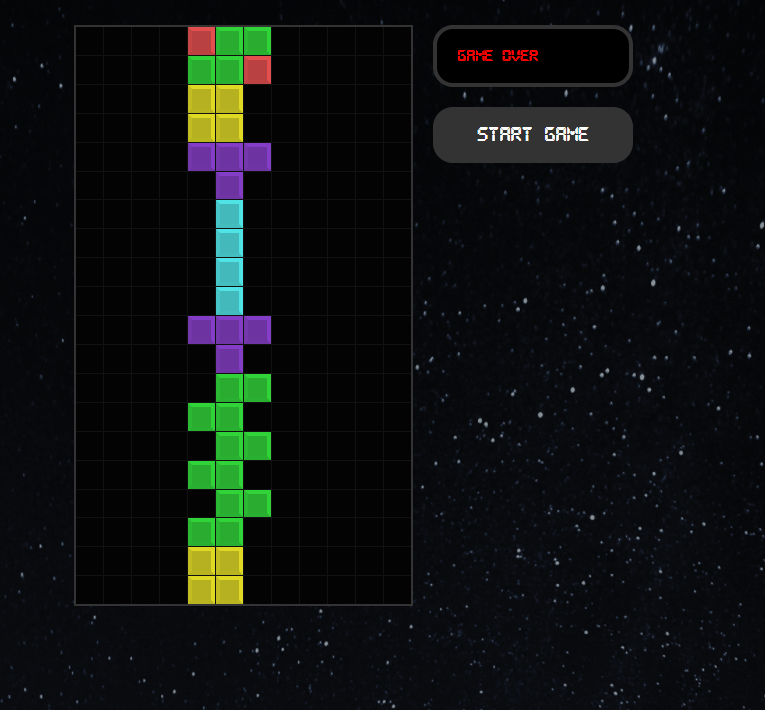

# **Le fameux Jeu Tetris en React !** :sunglasses: :nerd_face:

   

## **La version en ligne est disponible, HAVE FUN !** :star_struck:

**https://simplified-tetris.netlify.app/**

## **Ce jeu est basé sur 4 custom hooks :**

   * usePlayer : pour gérer le mouvement du tetromino
   * useStage : pour gérer le terrain de jeu
   * useInterval : qui remplace setInterval [Pourquoi ?](https://overreacted.io/making-setinterval-declarative-with-react-hooks)
   * useGameStatus: pour gérer le score et le niveau

##

